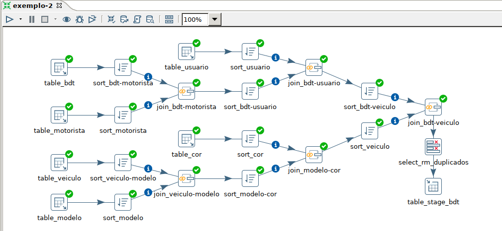

**Live: Pentaho muito mais que ETL**

- Rafael Arruda (pentarruda)


- Arquivos
  - [Script de criação do BD northwind](./arquivos/northwind_timestamp.sql)
  - [Script de carga do BD northwind](./arquivos/northwind_data_ajuste_enderecos.sql) (com os endereços ajustados)


TIPOS DE TOPOLOGIA

- Star Schema

  

- SnowFlake Schema

  

Tabelas

- Dimensões: armazena os registros descritivos com referência a uma tabela fato
- Fatos: Principal tabela de um DW. Ela se conecta com as suas dimensões.
  - possui as métricas (por isso fato) e as chaves FKs (foreing keys) usadas para ligação dos "fatos" com os dados das "dimenões"


ETL (Extract, Transform e Load)

- Extração: de diversas fontes
- Transformação: adequação dos dados extraídos e
- Carga: dos dados após as etapas anteriores no DW


Pentaho Data Integration (PDI)

- Migração de dados de local para outro

- Tratamento e Limpeza dos dados

- Criação de métricas e indicadores (em uma camada antes da visualização)

- Exportar (para outros formatos) e Integração com diversos BDs 

- Consumir Web Services e APIs

- Integração com várias plataformas de Big Data

  

  Componentes

  - **Spoon**: criação e transformação de jobs
  - **Kitchen**: Executa os job's de forma agendada e automática
  - **Pan**: Executa as transformações de forma agendada e automática
  - **Carte**: Web server para execução remota das transformações e jobs


- Exemplo 1: Trabalhando com arquivos (fazer depois)

  Objetivo: ler um arquivo csv, ordena, agrupa os valores de acordo com uma coluna e cria outro arquivo.

  


- Exemplo 2: Criar uma Stage no DW (fazer depois)

  Objetivo: ler dados de 4 tabelas, ordena, junta e trata e limpa e gravar em uma área (stage) no DW

  

  

- Exemplo 3: Criando Dimensões (fazer depois)

  Objetivo A: Carga full (limpa a tabela e carrega os dados)

  

  Objeto B: Carga incremental (compara os dados novos com os já existentes, caso seja novo, **inclui**, caso exista, **atualiza**)

  


- Exemplo 4: Trabalhando com API (fazer depois)

  Objetivo: Ler dados de uma API (estados do IBGE) e após diversas transformações salvar um arquivo com os dados

   


- Exemplo 5: Criando um job (fazer depois)

  Objetivo: Criar um job que executa diversas transformações, com mensagem em caso de erro no processo

  


MÉDIA DE ESFORÇO EM UM PROJETO DE BI (impressões do autor da live)

- Mapeamento da informações (levantamento de requisitos): 15%
- Construção e manutenção do ETL: 70~80% (considerando fontes diversas e Big Data)
- Criação de relatórios e dashboards: 15~5%


ETAPAS DE UM ETL QUE DEMANDAM MAIORES ATENÇÕES

- centralizar as informações mais relevantes

- estruturar o DW
- criar as dimensões, métricas e indicadores em um único lugar
- Segurança e confidencialidade das informações
- Informação atualizada e disponibilidade de dados de forma automática


**Prática**

Criação do banco northwind no MySQL e carga dos dados

nota: Foram utilizados os scripts do BD northwind para MySQL de https://github.com/dalers/mywind

- Importação dos scripts para uma pasta do SO através do SFTP do MobaXTerm

- criação do BD

  ```sh
  mysql -u root -h localhost -p12345678 < northwind_timestamp.sql
  ```

- carga dos dados

  ```sh
  mysql -u root -h localhost -p12345678 < northwind_data_ajuste_enderecos.sql
  ```


**Utilizando PDI**


- Step "Table input"

  - configurado a conexão c/ o banco de dados

    nota: foi preciso baixar o driver do MySql, descompactar o arquivo "mysql-connector-java-XXX.jar" e colar na pasta 'lib' da instalação do PDI. Após reiniciar o PDI

  - conectado com a tabela 'Orders'

    nota:

    - foi preciso fazer alguns ajustes nos dados:
      - alteração dos dados 'ship adrress' para ter endereços c/ número no início e no final

- Step "String operations": operações sobre strings

  - Trim Type: para retirar os espaços em banco do início e do final do campo

    - todos = both

  - Lower/Upper: para definir se o campo será todo maiúsculo ou minúsculo

    - todos = upper

  - Dividimos o 'ship adress' em dois campos 'rua' e 'numero'

    - criamos outro campo 'ship adress', na coluna 'out stream field', em cada campo seu respectivo nome 'rua' e 'numero'

    - depois na coluna 'digits', para 'rua'='remove' e 'numero='only'

      

  

  

- Step "Replace in string": substitui string
  
  - substituímos ',' e '.' por '' (vazio)
- Step "Concat field"
  - retiramos os espaços em branco de 'rua' e 'numero'
  - depois concatenamos os campos c/ o separado ', ' (vírgula, espaço)
- Step "If field value is null": substitui valores null
  - substituímos null por tipo (select value type)
    - integer=-1
    - string="N/I"
- Step "Select values": renomear, remover e alterar tipos de colunas
  - removemos 'rua', 'numero' e 'ship address'
  - reposicionamos e renomeamos 'ship endereco' para 'ship adress'
  - alteramos os formatos dos campos timestamp p/ 'yyyy-MM-dd'

- Step "Table input"

  - conectado com a tabela 'Orders)details'

- Step "Sort rows"

  - Ordenamos a tabela 'Orders' pelo campo 'id'
  - Ordenamos a tabela 'Orders_details' pelo campo 'order_id'

- Step "Merge join"

  nota: antes de fazer um join devemos ordenar as tabelas que usaremos

  - ligamos os de steps "Sort rows" de 'Orders' e 'Orders_details'

- Step "Database lookup": Substitui um valor por outro de acordo com uma tabela (ex. 'id' por 'nome')

  - Substituímos o 'custormer_id' da tabela 'Orders' por 'company' em 'Custormers'
  - renomeamos a coluna 'company' para 'customer_name'

  

- Step "Database lookup"

  - Substituímos o 'employee_id' da tabela 'Orders' por 'first_name' e 'last_name' em 'Employees'

- Step "Database lookup"

  - Substituímos o 'product_id' da tabela 'Orders' por 'product_name' em 'products'

- Step "Concat field"

  - concatenamos os campos 'first_name' e 'last_name'
  - renomeamos para 'employee_full_name'

- Step "Select values"
  - removemos 'first_name', 'last_name', 'order_id' (duplicado)
  - reposicionamos 'employee_full_name', 'customer_name' e 'product_name'

- Step "Calculator": Efetua cálculos pré- definidos (coluna cálculo)
  - calculamos 'qt_dias_envio'='shipped_date'-'order_date'
  - calculamos 'valor_total'='quantity'*'unit_price'
- 

- Step "Number range": retorna um valor em função de intervalos de um campo
  - Para valores de até 10 da coluna 'qt_dias_envio', retorna "DENTRO SLA"
  - Para valores acima de 10, retorna "FORA SLA"
  - Para valores fora desses intervalos ou null, retorna "N/E"

- Step "Switch / case": Seleciona os registros de acordo com os valores de um campo
  

- Step "Microsoft Excel writer": Cria um arquivo Excel de acordo com parâmetros definidos
  - cria os arquivos Excel:
    - dentro-sla_20210407.xlsx
    - fora-sla_20210407.xlsx
    - nao-entregues_sla_20210407.xlsx


Parado no e-mail vídeo: 01:41:00


```html
<!DOCTYPE html PUBLIC "-//W3C//DTD XHTML 1.0 Transitional//EN" "http://www.w3.org/TR/xhtml1/DTD/xhtml1-transitional.dtd">
<html xmlns="http://www.w3.org/1999/xhtml" xmlns:o="urn:schemas-microsoft-com:office:office">

<head>
    <meta charset="UTF-8">
    <meta content="width=device-width, initial-scale=1" name="viewport">
    <meta name="x-apple-disable-message-reformatting">
    <meta http-equiv="X-UA-Compatible" content="IE=edge">
    <meta content="telephone=no" name="format-detection">
    <title></title>
    <!--[if (mso 16)]>
    <style type="text/css">
    a {text-decoration: none;}
    </style>
    <![endif]-->
    <!--[if gte mso 9]><style>sup { font-size: 100% !important; }</style><![endif]-->
    <!--[if gte mso 9]>
<xml>
    <o:OfficeDocumentSettings>
    <o:AllowPNG></o:AllowPNG>
    <o:PixelsPerInch>96</o:PixelsPerInch>
    </o:OfficeDocumentSettings>
</xml>
<![endif]-->
</head>

<body>
    <div class="es-wrapper-color">
        <!--[if gte mso 9]>
			<v:background xmlns:v="urn:schemas-microsoft-com:vml" fill="t">
				<v:fill type="tile" color="#ffffff"></v:fill>
			</v:background>
		<![endif]-->
        <table class="es-wrapper" width="100%" cellspacing="0" cellpadding="0">
            <tbody>
                <tr>
                    <td class="esd-email-paddings" valign="top">
                        <table class="es-content esd-header-popover" cellspacing="0" cellpadding="0" align="center">
                            <tbody>
                                <tr>
                                    <td class="esd-stripe" esd-custom-block-id="5449" align="center">
                                        <table class="es-content-body" style="border-left:1px solid #836027;border-right:1px solid #836027;border-top:1px solid #836027;border-bottom:1px solid #836027;background-color: transparent;" width="600" cellspacing="0" cellpadding="0" bgcolor="#ffffff" align="center">
                                            <tbody>
                                                <tr>
                                                    <td class="esd-structure" style="background-color: #ffffff;" bgcolor="#ffffff" align="left">
                                                        <table width="100%" cellspacing="0" cellpadding="0">
                                                            <tbody>
                                                                <tr>
                                                                    <td class="esd-container-frame" width="598" valign="top" align="center">
                                                                        <table width="100%" cellspacing="0" cellpadding="0">
                                                                            <tbody>
                                                                                <tr>
                                                                                    <td class="esd-block-image es-p5t es-p10r es-p10l" align="center" style="font-size:0"><a target="_blank"></a></td>
                                                                                </tr>
                                                                            </tbody>
                                                                        </table>
                                                                    </td>
                                                                </tr>
                                                            </tbody>
                                                        </table>
                                                    </td>
                                                </tr>
                                            </tbody>
                                        </table>
                                    </td>
                                </tr>
                            </tbody>
                        </table>
                        <table class="es-content" cellspacing="0" cellpadding="0" align="center">
                            <tbody>
                                <tr>
                                    <td class="esd-stripe" esd-custom-block-id="5451" align="center">
                                        <table class="es-content-body" style="border-left: 1px solid #836027; border-right: 1px solid #836027; background-color: transparent;" width="600" cellspacing="0" cellpadding="0" align="center">
                                            <tbody>
                                                <tr>
                                                    <td class="esd-structure es-p20r es-p20l" align="left">
                                                        <table width="100%" cellspacing="0" cellpadding="0">
                                                            <tbody>
                                                                <tr>
                                                                    <td class="esd-container-frame" width="558" valign="top" align="center">
                                                                        <table width="100%" cellspacing="0" cellpadding="0">
                                                                            <tbody>
                                                                                <tr>
                                                                                    <td class="esd-block-text es-m-txt-c es-p15t es-p10b" align="left">
                                                                                        <p>Oi,&nbsp;</p>
                                                                                        <p>Segue os arquivos como de praxe.<br><br>Marcelo Santos</p>
                                                                                    </td>
                                                                                </tr>
                                                                            </tbody>
                                                                        </table>
                                                                    </td>
                                                                </tr>
                                                            </tbody>
                                                        </table>
                                                    </td>
                                                </tr>
                                            </tbody>
                                        </table>
                                    </td>
                                </tr>
                            </tbody>
                        </table>
                        <table class="es-content esd-footer-popover" cellspacing="0" cellpadding="0" align="center">
                            <tbody>
                                <tr>
                                    <td class="esd-stripe" esd-custom-block-id="5449" align="center">
                                        <table class="es-content-body" style="border-left:1px solid #836027;border-right:1px solid #836027;border-top:1px solid #836027;border-bottom:1px solid #836027;background-color: transparent;" width="600" cellspacing="0" cellpadding="0" bgcolor="#ffffff" align="center">
                                            <tbody>
                                                <tr>
                                                    <td class="esd-structure" style="background-color: #ffffff;" bgcolor="#ffffff" align="left">
                                                        <table width="100%" cellspacing="0" cellpadding="0">
                                                            <tbody>
                                                                <tr>
                                                                    <td class="esd-container-frame" width="598" valign="top" align="center">
                                                                        <table width="100%" cellspacing="0" cellpadding="0">
                                                                            <tbody>
                                                                                <tr>
                                                                                    <td class="esd-block-image es-p5t es-p10r es-p10l" align="center" style="font-size:0"><a target="_blank"></a></td>
                                                                                </tr>
                                                                            </tbody>
                                                                        </table>
                                                                    </td>
                                                                </tr>
                                                            </tbody>
                                                        </table>
                                                    </td>
                                                </tr>
                                            </tbody>
                                        </table>
                                    </td>
                                </tr>
                            </tbody>
                        </table>
                    </td>
                </tr>
            </tbody>
        </table>
    </div>
</body>

</html>
```

